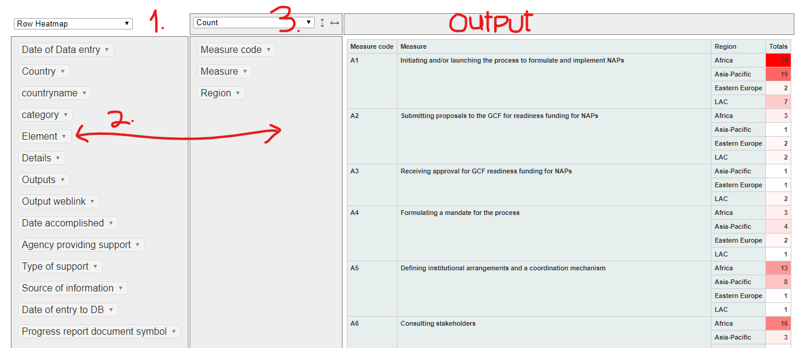

<style type="text/css">

.navbar-inverse .navbar-nav>.active>a, .navbar-inverse .navbar-nav>.active>a:hover, .navbar-inverse .navbar-nav>.active>a:focus {
color: #fbb034;
background-color: #00467f;
border-color: #002a4c;
font-weight: 900;
}

.chart-title {
    border-bottom: 1px solid #d7d7d7;
    color: #333333;
    font-size: 20px;
    font-weight: 700;
    padding: 7px 10px 4px;
}

.heading-level1 {  /* chart_title  */
   color: #00467f;
    font-size: 18px;
    font-weight: 500;
}

h4, .h4 {
   color: #002a4c;
    font-size: 15px;
    font-weight: 550;
}

a:visited {
   color: rgb(50%, 0%, 50%);
}

</style>


```{r libraries}
library(flexdashboard)
library(shiny)
library(readxl)
library(magrittr)
library(plotly)
library(ggplot2)
library(dplyr)
library(reshape)
library(rpivotTable)
library(htmlwidgets)
library(DT)
library(leaflet)
library(leaflet.extras)
library(crosstalk)
```


```{r global}
tracker<-as.data.frame(read_excel("Open_NAPs_Database.xlsm", sheet = "tracker"))
colnames(tracker)[colnames(tracker)=="Standard measure based on progress report"]<-"Measure"
tracker$Element<-factor(tracker$Element, levels = c("Laying the ground work and addressing gaps", "Preparatory elements" ,"Implementation strategies" ,"Reporting monitoring and review"))
measures<-as.data.frame(read_excel("Open_NAPs_Database.xlsm", sheet = "Measures"))
measures$`Without Measure`<-154-(measures$`Developing Countries  (non-LDC)`+measures$LDCs)
GCF_accessed<-as.data.frame(read_excel("Open_NAPs_Database.xlsm", sheet = "GCF_Accessed"))
GCF_projects<-as.data.frame(read_excel("Open_NAPs_Database.xlsm", sheet = "GCF"))
categories<-as.data.frame(read_excel("Open_NAPs_Database.xlsm", sheet = "country_categories"))
NAPS <- as.data.frame(read_excel("Open_NAPs_Database.xlsm",sheet = "Submitted_NAPs"))
country_codes_un <- as.data.frame(read_excel("Open_NAPs_Database.xlsm",sheet = "country_codes_un"))
regions <- as.data.frame(read_excel("Open_NAPs_Database.xlsm", sheet = "Regions"))
iso_cat<- as.data.frame(read_excel("Open_NAPs_Database.xlsm",sheet = "country_categories"))
latlong <-as.data.frame(read_excel("Open_NAPs_Database.xlsm",sheet = "countrylatlong"))
Readiness<- as.data.frame(read_excel("Open_NAPs_Database.xlsm",sheet = "Readiness"))%>%dplyr::filter(Activity=='Adaptation Planning (AP)')
approvals<-as.data.frame(read_excel("Open_NAPs_Database.xlsm", sheet = "Readiness_Approval"))%>%na.omit()
gef<-read_excel("Open_NAPs_Database.xlsm", sheet = "GEF")

#NAPS$`Date of submission`<-as.Date(NAPS$`Date of submission`, format ="%Y/%m/%d" )

#merge
GCF_merge<-merge(GCF_accessed, categories, by='countryname', all.x = T)
GCF_merge<-GCF_merge[,c(1,6,7,8,9,10,11)]

tracker_merge<-merge(tracker,categories, by='countryname', all.x = T)

unregions<-merge(country_codes_un, regions, by='countryname', all.x=TRUE)
unregions<-merge(unregions,iso_cat, by='countryname', all.x=TRUE)
NAPCountries<-merge(unregions,NAPS, by="countryname", all.y = TRUE)
xycountrycode<-merge(unregions,latlong, by='countryname', all.x = TRUE)
NAP_Countries<-merge(NAPS,xycountrycode, by="countryname", all.x = TRUE)

gef_merge<-merge(gef, categories, by='countryname', all.x = T)
gef_regions<-merge(gef_merge,regions, by='countryname', all = T)

#gef
ldcf<-gef_regions%>%filter(`Fund Source`=='Least Developed Countries Fund')%>%dplyr::group_by(countryname, Region, Category, Category2, Status)%>%summarise('Grant'=sum(Grant), 'Co-Finance'=sum(`Co-Financing`))

sccf<-gef_regions%>%filter(`Fund Source`=='Special Climate Change Fund')%>%dplyr::group_by(countryname, Region, Category, Category2, Status)%>%summarise('Grant'=sum(Grant), 'Co-Finance'=sum(`Co-Financing`))

sc_ldcf<-merge(ldcf,sccf, all.x =  T)


# data for crosstalk
df<-merge(GCF_accessed,regions, by="countryname")
df<-merge(df, Readiness, by="countryname", all.x=T)
df<-merge(df, approvals, by="countryname", all.x=T)
df<-merge(df, categories, by="countryname", all.x=T)
df<-df[,c(1,10,7,8,9,17,18,19,21,22,23,26,27,28,29,31,32)]
df<-merge(df, latlong, by='countryname', all.y = T)
df<-subset(df, `Grand Total GCF`!='NA')
df<-subset(df,`Grand Total GCF`!='0' )
df$countryname<-factor(df$countryname, levels = unique(df$countryname)[order(df$`Grand Total GCF`, decreasing = T)])

shared_df <- SharedData$new(df)
ldcf_shared<-SharedData$new(ldcf)
sccf_shared<-SharedData$new(sccf)


```


Measures
==================================================================================
column {.tabset}
-------------------------------------------------------------

### __Measures General Outlook__

```{r}
measures$Measure1wrap<-sapply(measures$Measure1, FUN = function(Measure1){paste(strwrap(Measure1, width = 79), collapse = "<br>")})

measures$Measure1wrap<-factor(measures$Measure1wrap, levels = unique(measures$Measure1wrap)[order(measures$Code, decreasing = TRUE)])

fig <- plot_ly(measures, x = ~LDCs, y = ~Measure1wrap, type = 'bar', orientation = 'h',  name = 'LDCs',
        marker = list(color = 'rgba(38, 24, 74, 0.8)'),text=~LDCs, textposition= 'top  right',textfont=list(size=12, color='white')) 

#,line = list(color = 'rgb(248, 248, 249)', width = 1)
fig <- fig %>% add_trace(x = ~`Developing Countries  (non-LDC)`,name='Developing Countries  (non-LDC)',  marker = list(color = 'rgba(71, 68, 131, 0.85)'),text=~`Developing Countries  (non-LDC)`, textposition= 'right',textfont=list(size=12, color='white')) 

fig <- fig %>% add_trace(x = ~`Without Measure`,name='Without Measure', marker = list(color = 'rgba(164, 163, 204, 0.95)'),text=~`Without Measure`, textposition= 'middle left',textfont=list(size=12, color='white')) 
fig <- fig %>% layout(xaxis = list(title = "No. of Countries",
                      showgrid = TRUE,
                      showline = FALSE,
                      showtext=T,
                      showticklabels = TRUE,
                      zeroline = FALSE,
                      domain = c(0.15, 1)),
         yaxis = list(title = "",
                      showgrid = FALSE,
                      showline = FALSE,
                      showticklabels = FALSE,
                      zeroline = FALSE),
         barmode = 'stack',
         paper_bgcolor = 'rgb(248, 248, 255)', plot_bgcolor = 'rgb(248, 248, 255)',
         margin = list(l = 200, r = 0, t = 10, b = 50),
         showlegend = TRUE, legend=list(orientation='h', x=0.2,y=-0.15))

# label yaxis
fig <- fig %>% add_annotations(xref = 'paper', yref = 'y', x = 0.14, y = ~Measure1wrap,
                  xanchor = 'right',
                  text = measures$Measure1wrap,
                  font = list(family = 'Arial', size = 12,
                            color = 'rgb(67, 67, 67)'),
                  showarrow = FALSE, align = 'center') 


fig

```

### __Measures Outlook - Grouped__
```{r}
A <- list(
  x = 2.5,
  y = 30,
  text = "Laying the groundwork \nand addressing gaps",
  xref = "x",
  yref = "y",
  showarrow = F,
  arrowhead = 7,
  ax = 20,
  ay = -40
)

B <- list(
  x = 2.5,
  y = 30,
  text = "Preparatory elements",
  xref = "x",
  yref = "y",
  showarrow = F,
  arrowhead = 7,
  ax = 20,
  ay = -40
)

C <- list(
  x = 2.0,
  y = 30,
  text = "Implementation strategies",
  xref = "x",
  yref = "y",
  showarrow = F,
  arrowhead = 7,
  ax = 20,
  ay = -40
)

D <- list(
  x = 2.0,
  y = 30,
  text = "Reporting, monitoring and review",
  xref = "x",
  yref = "y",
  showarrow = F,
  arrowhead = 7,
  ax = 20,
  ay = -40
)


mdf<-as.data.frame(measures[,c(1,4,5,7,6,8)])%>%reshape::melt(id.vars=c('Element', 'Measure1', 'Code'))

mdf$Measure1wrap<-sapply(mdf$Measure1, FUN = function(Measure1){paste(strwrap(Measure1, width = 45), collapse = "<br>")})

mdf$Measure1wrap<-factor(mdf$Measure1wrap, levels = unique(mdf$Measure1wrap)[order(mdf$Code, decreasing = F)])

plotA<-mdf%>%filter(Element=="A. Laying the groundwork and addressing gaps")%>%plot_ly(type='bar',y=~value,x=~Measure1wrap, color = ~variable, colors = c('#261C4A', '#47448A','#A4A3CC'),text=~value, textposition= 'middle',textfont=list(size=12, color='white'), showlegend=F)%>%
  plotly::layout(barmode='stack', xaxis = list(title = "A. Laying the groundwork and addressing gaps"),yaxis=list(title='No. of Countries'))

plotB<-mdf%>%filter(Element=="B. Preparatory elements")%>%plot_ly(type='bar',y=~value,x=~Measure1wrap,text=~value, textposition= 'bottom middle',textfont=list(size=12, color='white'), color = ~variable, colors = c('#261C4A', '#47448A','#A4A3CC'), showlegend=F)%>%
  plotly::layout(barmode='stack', xaxis = list(title = "B. Preparatory elements"),yaxis=list(title='No. of Countries'))

plotC<- mdf%>%filter(Element=="C. Implementation strategies")%>%plot_ly(type='bar',y=~value,x=~Measure1wrap,text=~value, textposition= 'middle',textfont=list(size=12, color='white'), color = ~variable, colors = c('#261C4A', '#47448A','#A4A3CC'), showlegend=F)%>%
  plotly::layout(barmode='stack', xaxis = list(title = "C. Implementation strategies"),yaxis=list(title='No. of Countries'))

plotD<-mdf%>%filter(Element=="D. Reporting, monitoring and review")%>% plot_ly(type='bar',y=~value,x=~Measure1wrap, text=~value, textposition= 'middle',textfont=list(size=12, color='white'), color = ~variable, colors = c('#261C4A', '#47448A','#A4A3CC'),  showlegend=T)%>%
  plotly::layout(legend=list(orientation='h', x=0.3, y=1.05), barmode='stack', xaxis = list(title = "D. Reporting, monitoring and review"),yaxis=list(title='No. of Countries'))


subplot(plotA, plotB,plotC, plotD, shareY = T, shareX = T, titleY = T, margin = 0.01)%>%layout(barmode='stack')


```


###### ggplot - delete

```{r}
library(gridExtra)
library(grid)
library(gtable)
mdf$Measure1wrap<-sapply(mdf$Measure1, FUN = function(Measure1){paste(strwrap(Measure1, width = 35), collapse = "\n")})

mdf$Measure1wrap<-factor(mdf$Measure1wrap, levels = unique(mdf$Measure1wrap)[order(mdf$Code, decreasing = T)])

a<-mdf%>%filter(Element=="A. Laying the groundwork and addressing gaps")%>%
  ggplot()+
  geom_bar(aes(y=Measure1wrap, x=value, fill=variable, text = value, textposition='top'), stat = 'identity', position = 'stack')+
  labs(x='', y='A. Laying the \ngroundwork and \naddressing gaps')+
  theme(legend.position = 'none',axis.text.x = element_blank(),  axis.ticks.x = element_blank())
b<-mdf%>%filter(Element=="B. Preparatory elements")%>%
  ggplot()+
  geom_bar(aes(y=Measure1wrap, x=value, fill=variable), stat = 'identity', position = 'stack')+
  labs(x='', y='B. Preparatory\n elements')+
  theme(legend.position = 'none',axis.text.x = element_blank(),  axis.ticks.x = element_blank())
c<-mdf%>%filter(Element=="C. Implementation strategies")%>%
  ggplot()+
  geom_bar(aes(y=Measure1wrap, x=value, fill=variable), stat = 'identity', position = 'stack')+
  labs(x='', y='C. Implementation\n strategies')+
  theme(legend.position = 'none',axis.text.x = element_blank(),  axis.ticks.x = element_blank())
d<-mdf%>%filter(Element=="D. Reporting, monitoring and review")%>%
  ggplot()+
  geom_bar(aes(y=Measure1wrap, x=value, fill=variable), stat = 'identity', position = 'stack')+
  labs(x='No. of Countries', y='D. Reporting,\n monitoring \n and review')+
  theme(legend.position = 'bottom', legend.direction = 'horizontal', legend.title = element_blank())


#grid.arrange(a,b,c,d, nrow=4, ncol=1)
a1<-ggplotGrob(a)
b1<-ggplotGrob(b)
c1<-ggplotGrob(c)
d1<-ggplotGrob(d)
g<-rbind(a1,b1,c1,d1, size='last')
g$widths <- unit.pmax(a1$widths, b1$widths,c1$widths, d1$widths)
grid.newpage()
grid.draw(g)

```

###### OTHER G 
```{r}
ggplot(mdf)+
  geom_bar(stat = 'identity', position = 'stack', aes(x=value, y=Measure1, fill=variable))+
  facet_grid(vars(Element) )
```


Select Measures

### __Select Measures- General Outlook__
```{r}
mselect<-measures%>%dplyr::filter(Code=='A1'|Code=='A2'|Code=='A3'|Code=='A8'|Code=='A9'|Code=='B3'|Code=='B7'|Code=='C3'|Code=='D4')

mselect$Measure1<-factor(mselect$Measure1, levels = unique(mselect$Measure1)[order(mselect$Code, decreasing = TRUE)])

mselect$Measure1wrap<-sapply(mselect$Measure1, FUN = function(Measure1){paste(strwrap(Measure1, width = 60), collapse = "<br>")})

plot_ly(mselect, x = ~LDCs, y = ~Measure1, type = 'bar', orientation = 'h', text=~LDCs, textposition= 'left',textfont=list(size=12, color='white'), name = 'LDCs',
        marker = list(color = 'rgba(38, 24, 74, 0.8)'))%>%
 add_trace(x = ~`Developing Countries  (non-LDC)`,name='Developing Countries (non-LDC)', marker = list(color = 'rgba(71, 68, 131, 0.85)'),text=~`Developing Countries  (non-LDC)`, textposition= 'right',textfont=list(size=12, color='white'))%>%
  add_trace(x = ~`Without Measure`,name='Without Measure', marker = list(color = 'rgba(164, 163, 204, 0.95)'),text=~`Without Measure`, textposition= 'middle',textfont=list(size=12, color='white'))%>% 
  layout(xaxis = list(title = "No. of Countries",
                      showgrid = TRUE,
                      showline = FALSE,
                      showtext=T,
                      showticklabels = TRUE,
                      zeroline = FALSE,
                      domain = c(0.15, 1)),
         yaxis = list(title = "",
                      showgrid = FALSE,
                      showline = FALSE,
                      showticklabels = FALSE,
                      zeroline = FALSE),
         barmode = 'stack',
         paper_bgcolor = 'rgb(248, 248, 255)', plot_bgcolor = 'rgb(248, 248, 255)',
         margin = list(l = 200, r = 0, t = 10, b = 50),
         showlegend = TRUE, legend=list(orientation='h', x=0.2,y=-0.15))%>%
  add_annotations(xref = 'paper', yref = 'y', x = 0.14, y = ~Measure1,
                  xanchor = 'right',
                  text = mselect$Measure1wrap,
                  font = list(family = 'Arial', size = 12,
                            color = 'rgb(67, 67, 67)'),
                  showarrow = FALSE, align = 'center') 

```


#### __Important Measures -  general__

```{r}
#selected_measures<-measures%>%dplyr::filter(Code=='A1'|Code=='A2'|Code=='A3'|Code=='A8'|Code=='A9'|Code=='B3'|Code=='B7'|Code=='C3'|Code=='D4')
selected_measures<-tracker_merge%>%dplyr::filter(`Measure code`=='A1'|`Measure code`=='A2'|`Measure code`=='A3'|`Measure code`=='A8'|`Measure code`=='A9'|`Measure code`=='B3'|`Measure code`=='B7'|`Measure code`=='C3'|`Measure code`=='D4')

df1<-selected_measures%>%group_by(Element,Measure,`Measure code`)%>%count(Country)%>%
  summarise('Countries'=sum(n))

df1$Measurewrap<-sapply(df1$Measure, FUN = function(Measure){paste(strwrap(Measure, width = 40), collapse = "<br>")})
df1$Measurewrap<-factor(df1$Measurewrap, levels = unique(df1$Measurewrap)[order(df1$`Measure code`,decreasing = F)])

plot_ly(df1,type='bar',x=~Measurewrap, y=~Countries, text=~Countries, textposition='auto', color = ~Measure, colors = 'Blues',legendgroup=~Measure, showlegend=F)%>%
  plotly::layout(barmode='stack', xaxis = list(title = "Measure"),yaxis=list(title='No. of Countries'))

```


### __Select Measures - By Region__

```{r}

aftitle <- list(
  x = 2.5,
  y = 30,
  text = "Africa",
  xref = "x",
  yref = "y",
  showarrow = F,
  arrowhead = 7,
  ax = 20,
  ay = -40
)

asiatitle <- list(
  x = 2.5,
  y = 30,
  text = "Asia-Pacific",
  xref = "x",
  yref = "y",
  showarrow = F,
  arrowhead = 7,
  ax = 20,
  ay = -40
)

lactitle <- list(
  x = 2.5,
  y = 30,
  text = "Latin America &\nthe Caribbean",
  xref = "x",
  yref = "y",
  showarrow = F,
  arrowhead = 7,
  ax = 20,
  ay = -40
)

eutitle <- list(
  x = 2.5,
  y = 30,
  text = "Eastern Europe",
  xref = "x",
  yref = "y",
  showarrow = F,
  arrowhead = 7,
  ax = 20,
  ay = -40
)


africa<-selected_measures%>%filter(Region=='Africa')%>% group_by(Measure,`Measure code`)%>%count(Country)%>%
  summarise('Countries'=sum(n))

africa$Measurewrap<-sapply(africa$Measure, FUN = function(Measure){paste(strwrap(Measure, width = 55), collapse = "<br>")})

africa$Measurewrap<-factor(africa$Measurewrap, levels = unique(africa$Measurewrap)[order(africa$`Measure code`,decreasing = F)])

af_plot<-plot_ly(africa,type='bar',x=~Measurewrap,y=~Countries, color = ~Measure, colors = 'Blues',legendgroup=~Measure, showlegend=F)%>%
  plotly::layout(annotations=aftitle, barmode='stack', xaxis = list(title = ""),yaxis=list(title='No. of Countries', showline=T, linecolor='black',mirror=F, linewidth=2))


asia_pacific<-selected_measures%>%filter(Region=='Asia-Pacific')%>% group_by(Measure,`Measure code`)%>%count(Country)%>%
  summarise('Countries'=sum(n))

asia_pacific$Measurewrap<-sapply(asia_pacific$Measure, FUN = function(Measure){paste(strwrap(Measure, width = 55), collapse = "<br>")})

asia_pacific$Measurewrap<-factor(asia_pacific$Measurewrap, levels = unique(asia_pacific$Measurewrap)[order(asia_pacific$`Measure code`,decreasing = F)])

asia_plot<-plot_ly(asia_pacific, type='bar',x=~Measurewrap,y=~Countries, color = ~Measure, colors = 'Blues',legendgroup=~Measure, showlegend=F)%>%
  plotly::layout(annotations=asiatitle, barmode='stack', xaxis = list(title = ""),yaxis=list(title='No. of Countries', showline=T,mirror=F, linecolor='black', linewidth=2))


lac<-selected_measures%>%filter(Region=='LAC')%>% group_by(Measure,`Measure code`)%>%count(Country)%>%
  summarise('Countries'=sum(n))

lac$Measurewrap<-sapply(lac$Measure, FUN = function(Measure){paste(strwrap(Measure, width = 55), collapse = "<br>")})

lac$Measurewrap<-factor(lac$Measurewrap, levels = unique(lac$Measurewrap)[order(lac$`Measure code`,decreasing = F)])

lac_plot<-plot_ly(lac,type='bar',x=~Measurewrap,y=~Countries, color = ~Measure, colors = 'Blues',legendgroup=~Measure, showlegend=F)%>%
  plotly::layout(annotations=lactitle, barmode='stack', xaxis = list(title = ""),yaxis=list(title='No. of Countries', showline=T,mirror=F, linecolor='black', linewidth=2))


eu<-selected_measures%>%filter(Region=='Eastern Europe')%>% group_by(Measure,`Measure code`)%>%count(Country)%>%
  summarise('Countries'=sum(n))

eu$Measurewrap<-sapply(eu$Measure, FUN = function(Measure){paste(strwrap(Measure, width = 55), collapse = "<br>")})

eu$Measurewrap<-factor(eu$Measurewrap, levels = unique(eu$Measurewrap)[order(eu$`Measure code`,decreasing = F)])

eu_plot<-plot_ly(eu,type='bar',x=~Measurewrap,y=~Countries, color = ~Measure, colors = 'Blues',legendgroup=~Measure, showlegend=F)%>%
  plotly::layout(annotations=eutitle, barmode='stack', xaxis = list(title = ""),yaxis=list(title='No. of Countries', showline=T,mirror=F, linecolor='black', linewidth=2))


plotly::subplot(af_plot, asia_plot,lac_plot,eu_plot, titleX = T,shareY = T, margin = 0.01)%>% layout(barmode = 'stack',plot_bgcolor='#e5ecf6')

```

#### __Important Measures by Country Category__

```{r}

ldc<-selected_measures%>%filter(Category=='LDC')%>% group_by(Measure,`Measure code`)%>%count(Country)%>%
  summarise('Countries'=sum(n))
ldc_plot<-plot_ly(ldc,type='bar',x=paste(ldc$`Measure code`, substr(ldc$Measure, 1,40), '...',sep = '-'),y=~Countries, color = ~Measure, colors = 'Blues', showlegend=F)%>%
  plotly::layout(barmode='stack', xaxis = list(title = "LDC"),yaxis=list(title='No. of Countries'))


sids<-selected_measures%>%filter(Category=='SIDS')%>% group_by(Measure,`Measure code`)%>%count(Country)%>%
  summarise('Countries'=sum(n))
sids_plot<-plot_ly(sids, type='bar',x=paste(sids$`Measure code`, substr(sids$Measure, 1,40), '...',sep = '-'),y=~Countries, color = ~Measure, colors = 'Blues', showlegend=F)%>%
  plotly::layout(barmode='stack', xaxis = list(title = "SIDS"),yaxis=list(title='No. of Countries'))


ldc_sids<-selected_measures%>%filter(Category=='LDC, SIDS')%>% group_by(Measure,`Measure code`)%>%count(Country)%>%
  summarise('Countries'=sum(n))
ldc_sids_plot<-plot_ly(ldc_sids, type='bar',x=paste(ldc_sids$`Measure code`, substr(ldc_sids$Measure, 1,40), '...',sep = '-'),y=~Countries, color = ~Measure, colors = 'Blues', showlegend=T)%>%
  plotly::layout(barmode='stack', xaxis = list(title = "LDC,SIDS"),yaxis=list(title='No. of Countries'))


lldc<-selected_measures%>%filter(Category=='LLDC')%>% group_by(Measure,`Measure code`)%>%count(Country)%>%
  summarise('Countries'=sum(n))
lldc_plot<-plot_ly(lldc, type='bar',x=paste(lldc$`Measure code`, substr(lldc$Measure, 1,40), '...',sep = '-'),y=~Countries, color = ~Measure, colors = 'Blues', showlegend=F)%>%
  plotly::layout(barmode='stack', xaxis = list(title = "LLDC"),yaxis=list(title='No. of Countries'))


ldc_lldc<-selected_measures%>%filter(Category=='LDC, LLDC')%>% group_by(Measure,`Measure code`)%>%count(Country)%>%
  summarise('Countries'=sum(n))
ldc_lldc_plot<-plot_ly(ldc_lldc, type='bar',x=paste(ldc_lldc$`Measure code`, substr(ldc_lldc$Measure, 1,40), '...',sep = '-'),y=~Countries, color = ~Measure, colors = 'Blues', showlegend=F)%>%
  plotly::layout(barmode='stack', xaxis = list(title = "LDC,LLDC"),yaxis=list(title='No. of Countries'))


otherdc<-selected_measures%>%filter(Category=='Other developing country')%>% group_by(Measure,`Measure code`)%>%count(Country)%>%
  summarise('Countries'=sum(n))
otherdc_plot<-plot_ly(otherdc,type='bar',x=paste(otherdc$`Measure code`, substr(otherdc$Measure, 1,40), '...',sep = '-'),y=~Countries, color = ~Measure, colors = 'Blues',legendgroup=~Measure, showlegend=F)%>%
  plotly::layout(barmode='stack', xaxis = list(title = "Other DC"),yaxis=list(title='No. of Countries'))


plotly::subplot(ldc_plot,sids_plot,ldc_sids_plot,lldc_plot,ldc_lldc_plot,otherdc_plot, titleX = T,shareY = T)%>% layout(barmode = 'stack', showlegend = F)


```

### __Select Measures - By Country Category__

```{r}
ldctitle <- list(
  x = 3,
  y = 35,
  text = "LDCs",
  xref = "x",
  yref = "y",
  showarrow = F,
  arrowhead = 7,
  ax = 20,
  ay = -40
)

otherdctitle <- list(
  x = 3,
  y = 35,
  text = "Other Developing Countries",
  xref = "x",
  yref = "y",
  showarrow = F,
  arrowhead = 7,
  ax = 20,
  ay = -40
)


ldc<-selected_measures%>%filter(Category2=='LDC')%>% group_by(Measure,`Measure code`)%>%count(Country)%>%
  summarise('Countries'=sum(n))

ldc$Measurewrap<-sapply(ldc$Measure, FUN = function(Measure){paste(strwrap(Measure, width = 20), collapse = "<br>")})

ldc$Measurewrap<-factor(ldc$Measurewrap, levels = unique(ldc$Measurewrap)[order(ldc$`Measure code`,decreasing = F)])

ldc_plot<-plot_ly(ldc,type='bar',x=~Measurewrap,y=~Countries, color = ~Measure, colors = 'Blues', showlegend=F)%>%
  plotly::layout(annotations=ldctitle, barmode='stack', xaxis = list(title = " "),yaxis=list(title='No. of Countries'))


otherdc<-selected_measures%>%filter(Category2=='Other developing country')%>% group_by(Measure,`Measure code`)%>%count(Country)%>%
  summarise('Countries'=sum(n))

otherdc$Measurewrap<-sapply(otherdc$Measure, FUN = function(Measure){paste(strwrap(Measure, width = 20), collapse = "<br>")})

otherdc$Measurewrap<-factor(otherdc$Measurewrap, levels = unique(otherdc$Measurewrap)[order(otherdc$`Measure code`,decreasing = F)])

otherdc_plot<-plot_ly(otherdc,type='bar',x=~Measurewrap,y=~Countries, color = ~Measure, colors = 'Blues', showlegend=F, name='Other DC')%>%
  plotly::layout(annotations=otherdctitle,barmode='stack', xaxis = list(title = ""),yaxis=list(title='No. of Countries'))


plotly::subplot(ldc_plot,otherdc_plot, titleX = T,shareY = T, margin = 0.01)%>% layout(barmode = 'stack', plot_bgcolor='#e5ecf6', showlegend = F)


```

###### __Measures Select- Outlook__

```{r}
mshort<-selected_measures[,c(3,5,6,7,8,19)]%>%group_by(Measure, Category2, `Measure code`)%>%count(Country)%>%summarise("Countries"=sum(n))
mshort$`Measure code`<-factor(mshort$`Measure code`, levels = unique(mshort$`Measure code`)[order(mshort$`Measure code`, decreasing = TRUE)])
#mshort%>%group_by(Measure)%>%count(Country)%>%summarise("Countries"=sum(n))
plot_ly(mshort, type='bar', x=~Countries, y=paste(mshort$`Measure code`,':', substr(mshort$Measure, 1, 40), '...'), color = ~Category2)%>%plotly::layout(barmode='stack')

#ggplot(mshort)+
 # geom_bar(stat = 'identity', aes(x=Countries, y=paste(mshort$`Measure code`, ':', substr(mshort$Measure, 1, 40), '...'), fill=Category2, #colour=Category2))
```


Find full list of measures[here](do we have a sharable link for the measures?)

Measures-Interactive
============================================

column {.tabset}
-------------------------------

###  __All Measures__

_*** To un-filter, delete item from filter box_,          _** To reset all filters, refresh your browser_

```{r}

mdf<-as.data.frame(measures[,-c(2,3,4,9)])%>%reshape::melt(id.vars=c('Element', 'Measure1'))

mdf$Measure1wrap<-sapply(mdf$Measure1, FUN = function(Measure1){paste(strwrap(Measure1, width = 79), collapse = "<br>")})

mdf$Measure1wrap<-factor(mdf$Measure1wrap, levels = unique(measures$Measure1wrap)[order(measures$Code, decreasing = TRUE)])

mykey <- highlight_key(mdf)

p<-mykey%>%
  plot_ly(type = 'bar',  x=~value, y=~Measure1wrap, color =~variable, colors = c("#50456e","#615f95","#a9a8cf"), text=~value, textposition= 'top  right',textfont=list(size=12, color='white'), height = 800)%>%
  layout(barmode='stack', legend=list(orientation='h', x=0, y=-0.18), xaxis=list(title='No. of Countries'), yaxis=list(title='', standoff=45))

filter <- bscols(
    filter_select('id', '- Select an Element', mykey, ~Element),
  filter_select("id", "     Select a measure", mykey, ~Measure1wrap),
  ggplotly(p, dynamicTicks = TRUE),
  widths = c(3,3, 10))

filter

```

### __Select Measures__

_*** To un-filter, delete item from filter box_,          _** To reset all filters, refresh your browser_

```{r}


mselect<-measures%>%dplyr::filter(Code=='A1'|Code=='A2'|Code=='A3'|Code=='A8'|Code=='A9'|Code=='B3'|Code=='B7'|Code=='C3'|Code=='D4')

mdf_select<-as.data.frame(mselect[,-c(2,3,4,9)])%>%reshape::melt(id.vars=c('Element', 'Measure1'))

mdf_select$Measure1wrap<-sapply(mdf_select$Measure1, FUN = function(Measure1){paste(strwrap(Measure1, width = 60), collapse = "<br>")})

mdf_select$Measure1wrap<-factor(mdf_select$Measure1wrap, levels = unique(mselect$Measure1wrap)[order(mselect$Code, decreasing = TRUE)])


mselectkey <- highlight_key(mdf_select)

p<-mselectkey%>%
  plot_ly(type = 'bar',  x=~value, y=~Measure1wrap, color =~variable, colors = c("#50456e","#615f95","#a9a8cf"), text=~value, textposition= 'top  right',textfont=list(size=12, color='white'), height = 800)%>%
  layout(barmode='stack', legend=list(orientation='h', x=0, y=-0.18), xaxis=list(title='No. of Countries'), yaxis=list(title='', standoff=45))

filter <- bscols(
    filter_select('id', '- Select an Element', mselectkey, ~Element),
  filter_select("id", "     Select a measure", mselectkey, ~Measure1wrap),
  ggplotly(p, dynamicTicks = TRUE),
  widths = c(3,3, 10))

filter

```


```{r, eval=FALSE}

########Filter {.sidebar}
 ---------------------------------
  
  
measures$Measure1wrap<-sapply(measures$Measure1, FUN = function(Measure1){paste(strwrap(Measure1, width = 79), collapse = "<br>")})

measures$Measure1wrap<-factor(measures$Measure1wrap, levels = unique(measures$Measure1wrap)[order(measures$Code, decreasing = TRUE)])

shared_measures<-SharedData$new(measures)

filter_select("Element", "Select Element", shared_measures, ~Element, multiple=TRUE, allLevels = TRUE)
filter_select("Measure", "Select Measure", shared_measures, ~Measure, multiple=TRUE, allLevels = TRUE)

#__*** To un-filter, delete item from filter box__

#__*** To reset all filters, refresh your browser__

```


```{r, eval=FALSE}


column
 ------------------------------------------
 ### Measures Outlook
  
plot_ly(shared_measures, x = ~LDCs, y = ~Measure1wrap, type = 'bar', orientation = 'h',  name = 'LDCs',
        marker = list(color = 'rgba(38, 24, 74, 0.8)'),text=~LDCs, textposition= 'top  right',textfont=list(size=12, color='white')) %>%
  add_trace(x = ~`Developing Countries  (non-LDC)`,name='Developing Countries  (non-LDC)',  marker = list(color = 'rgba(71, 68, 131, 0.85)'),text=~`Developing Countries  (non-LDC)`, textposition= 'right',textfont=list(size=12, color='white'))%>%
  add_trace(x = ~`Without Measure`,name='Without Measure', marker = list(color = 'rgba(164, 163, 204, 0.95)'),text=~`Without Measure`, textposition= 'middle left',textfont=list(size=12, color='white')) %>% 
  layout(xaxis = list(title = "No. of Countries",
                      showgrid = TRUE,
                      showline = FALSE,
                      showtext=T,
                      showticklabels = TRUE,
                      zeroline = FALSE,
                      domain = c(0.15, 1)),
         yaxis = list(title = "",
                      showgrid = FALSE,
                      showline = FALSE,
                      showticklabels = FALSE,
                      zeroline = FALSE),
         barmode = 'stack',
         paper_bgcolor = 'rgb(248, 248, 255)', plot_bgcolor = 'rgb(248, 248, 255)',
         margin = list(l = 200, r = 0, t = 10, b = 50),
         showlegend = TRUE, legend=list(orientation='h', x=0.2,y=-0.15))%>%
  add_annotations(xref = 'paper', yref = 'y', x = 0.14, y = ~Measure1wrap,
                  xanchor = 'right',
                  text = measures$Measure1wrap,
                  font = list(family = 'Arial', size = 12,
                            color = 'rgb(67, 67, 67)'),
                  showarrow = FALSE, align = 'center') 


```

Measures - Categorized
============================================================

row
------------------------------------------


### 
```{r}

xx<-tracker_merge%>%group_by(Measure,`Measure code`,Country, Region, Category, Element)%>%count(Country)%>%
  summarise('Countries'=sum(n))

shared_xx<-SharedData$new(xx)

plot_cat<-shared_xx%>%
  plot_ly(type = 'bar',
    x=~Countries,
    y=~Category,
   color = ~`Measure code`,
   name = ~paste(`Measure code`, Measure,sep=':'),
   text= ~paste(Measure, Country, sep ="\n"),
   textposition= 'none',
   hoverinfo='text',
   showlegend=F
  )%>%layout(barmode='stack')

plot_reg<-shared_xx%>%
  plot_ly(type = 'bar',
    x=~Countries,
    y=~Region,
    color = ~`Measure code`,
     name = ~paste(`Measure code`, Measure,sep=':'),
    text= ~paste(Measure, Country, sep ="\n"),
   textposition= 'none',
   hoverinfo='text',
   showlegend=T
  )%>%layout(barmode='stack')

subplot(plot_cat,plot_reg, nrows = 2, margin = 0.05)
```

##### gg
```{r, eval=FALSE}
x<-ggplot(shared_reg, aes(Countries, `Measure code`))+
   geom_bar(aes(fill = Element, color = Region), position = "stack", stat = "identity")+scale_color_manual(values = c(rep("grey", 17)))+theme(legend.position = "none")
ggplotly(x)
```


Filters {.sidebar}
--------------------------------------------

```{r}


filter_select("Element", "Select Element", shared_xx, ~Element, multiple=TRUE, allLevels = TRUE)
filter_select("Measure", "Select Measure", shared_xx, ~Measure, multiple=TRUE)
#filter_checkbox("All", "Select Country", shared_xx, ~Country,columns = 1, allLevels = F)

#filter_select("Region", "Filter by Region", shared_tracker, ~Region, multiple=TRUE, allLevels = TRUE)

#filter_checkbox("Country Category", "Filter by Category", shared_tracker, ~Category2,columns = 2, inline=T, allLevels = FALSE)

#filter_select("Cat2", "More Categories", shared_tracker, ~Category, multiple=TRUE)
 
#filter_slider("Time in Months","Time (months) taken to approve GCF",shared_tracker,~`Time-to-approve (Months)`, min = 0, max = 40, width = 200)


``` 


__*** To un-filter, delete item from filter box__

__** To reset all filters, refresh your browser__


```{js}
function filter_default() {
    document.getElementById("Select Element").getElementsByClassName("selectized") 
[0].selectize.setValue("Laying the ground work and addressing gaps", false);
 }
$(document).ready(filter_default);

```


NAP Submissions
========================================================

### __Countries with submitted NAPS__

```{r, warning=FALSE, message=F}

library(ggmap)
library(tidyverse)

NAP_Countries<-NAP_Countries%>%mutate(hasNAP=paste('Yes'))
NAP_Countries$`Document title`<-paste('<a href=',NAP_Countries$Link, '>',NAP_Countries$`Document title`,'</a>', sep = "")

NAP_Countries<-NAP_Countries%>%
   mutate(popup_info=paste('<strong><strong>',countryname,"<br>","Submitted on:",NAP_Countries$`Date of submission`,"<br>","Title:",NAP_Countries$`Document title`))


                             
map.world <- map_data("world")
map.world_joined <- left_join(map.world, NAP_Countries, by = c('region' = 'countryname'))

library(leaflet)
#NAP_Countries$`Document title`<-paste('<a href=',NAP_Countries$Link, '>',NAP_Countries$`Document title`,'</a>', sep = "")

#NAP_Countries<-NAP_Countries%>%
  # mutate(popup_info=paste(countryname,"<br>","Submitted on:",NAP_Countries$`Date of submission`,"<br>","Title:",NAP_Countries$`Document title`))

leaflet()%>%setView(lng= 35.79, lat= -9.71 , zoom = 2.5)%>%
  addProviderTiles(providers$CartoDB)%>%
  setMaxBounds(0,-60,90,60)%>%
  #addCircleMarkers(data=NAP_Countries, fill=T,lng=~lon, lat =~lat, radius = 6, color='red', popup =~popup_info)%>%
  addAwesomeMarkers(data=NAP_Countries, lng=~lon, lat =~lat, popup =~popup_info)%>%
  #addPolygons(data = map.world_joined,lng=~long, lat =~lat.x,fill=~hasNAP, popup =~popup_info )%>%
  addMiniMap()


```


GCF {style="position:relative;"}
============================================================

Filters {.sidebar}
--------------------------------------------

```{r}
filter_select("Region", "Filter by Region", shared_df, ~Region, multiple=TRUE, allLevels = TRUE)

filter_checkbox("Country Category", "Filter by Category", shared_df, ~Category2,columns = 2, inline=T, allLevels = FALSE)

filter_select("Cat2", "More Categories", shared_df, ~Category, multiple=TRUE)
 
#filter_slider("Time in Months","Time (months) taken to approve GCF",shared_df,~`Time-to-approve (Months)`, min = 0, max = 40, width = 200)


``` 


__*** To un-filter, delete the item from filter box__


Column { .tabset, style="height:200pc;", data-height=650}
-------------------------------------------------------


### __Total GCF by Country__ {data-commentary-width=400}
```{r}

shared_df%>%
  plot_ly(type='bar', x=~countryname,y=~`Grand Total GCF`, showlegend=F)%>%
          plotly::layout(title='', xaxis = list(title = "", tickangle=90, tickfont=list(size=12), categoryorder='category ascending'),yaxis=list( tickfont=list(size=12), title='Amount ((Million USD)', titlefont=list(size=14)))
  

```


### __Total GCF Project Amounts by Country__ {data-commentary-width=400}
```{r}

shared_df%>%
  plot_ly(type='bar', x=~countryname,y=~`Total GCF financing (projects)`, showlegend=F)%>%
          plotly::layout(title='', xaxis = list(title = "", tickangle=90, tickfont=list(size=12),categoryorder='category ascending'),yaxis=list( tickfont=list(size=14), title='Amount ((Million USD)', titlefont=list(size=14)))
  

```

column {data-width=220, data-height=350}
-----------------------------------------
### __GCF Resources by Country__
```{r}
popup<-paste(df$countryname,'<br>', 'Total GCF: USD', df$`Grand Total GCF`, 'M')

shared_df%>%
  leaflet()%>%
  setView(lng = 35.79,lat = -9.71, zoom = 1.49)%>%
  addProviderTiles(providers$OpenStreetMap)%>%
  #setMaxBounds(-90,-60,90,60)%>%
  addCircleMarkers(fill = T, radius = ~`Grand Total GCF`*0.05,weight =~`Total GCF financing (projects)`*0.01, color = '#fc7204',
    label = lapply(as.list(paste('<strong><strong>',df$countryname,'<br>', 'Total GCF: USD', df$`Grand Total GCF`,'M')), HTML),popup=paste(df$countryname,'<br>', 'Total GCF: USD', df$`Grand Total GCF`)
)%>%addMeasure()%>%addResetMapButton()
#%>%
 # addCircles(fill = T, fillColor = 'red',fillOpacity = 0.5, weight = ~`Readiness support approved`*2,popup = paste(df$countryname,'<br>', 'Total GCF:', df$`Grand Total GCF`,'<br>', 'Total Readiness:', df$`Readiness support approved`))
#%>%addLegend('bottomleft', values = ~`Grand Total GCF`, title = 'GCF Total', labFormat = labelFormat(prefix = '$'), colors = 'browns')
```


#### __GCF Projects Resources by Country__

```{r}
popup<-paste(df$countryname,'<br>', 'Total GCF Projects: USD', df$`Total GCF financing (projects)`)

shared_df%>%
  leaflet()%>%
  setView(lng = 35.79,lat = -9.71, zoom = 1.49)%>%
  addProviderTiles(providers$OpenStreetMap)%>%
  #setMaxBounds(-90,-60,90,60)%>%
  addCircleMarkers(fill = T, radius = ~`Total GCF financing (projects)`*0.05,weight =~`Total GCF financing (projects)`*0.01, color = '#fc7204',
    label = lapply(as.list(paste('<strong><strong>',df$countryname,'<br>', 'Total GCF Projects: USD', df$`Total GCF financing (projects)`,'M')), HTML),popup=paste(df$countryname,'<br>', 'Total GCF Projects: USD', df$`Total GCF financing (projects)`)
)%>%addMeasure()%>%addResetMapButton()
#%>%
 # addCircles(fill = T, fillColor = 'red',fillOpacity = 0.5, weight = ~`Readiness support approved`*2,popup = paste(df$countryname,'<br>', 'Total GCF:', df$`Grand Total GCF`,'<br>', 'Total Readiness:', df$`Readiness support approved`))
#%>%addLegend('bottomleft', values = ~`Grand Total GCF`, title = 'GCF Total', labFormat = labelFormat(prefix = '$'), colors = 'browns')
```


### Map Notes

 * The bigger the circle marker, the larger the Total GCF amount the country has accessed (incl. Projects and NAP readiness).

 * The thicker the circle outline, the larger the amount the country has accessed specifically for GCF funded projects. 


```{r,eval=FALSE}

t<-shared_df%>%
  plot_ly(type='bar', x=~countryname,y=~`Grand Total GCF`, showlegend=F)%>%
          plotly::layout(title='', xaxis = list(title = "", tickangle=90, tickfont=list(size=12)),yaxis=list( tickfont=list(size=14), title='Amount ((Million USD)', titlefont=list(size=14)))


r<-shared_df%>%
      plot_ly(x=~countryname,y=~`Readiness support approved`, showlegend=F)%>%
          plotly::layout(title='', xaxis = list(title = "", tickangle=90, tickfont=list(size=12)),yaxis=list( tickfont=list(size=14), title='Amount ((Million USD)', titlefont=list(size=14)))


subplot(t,r, nrows = 2, margin = 0.05)

```

NAP Readiness
==========================

Filters {.sidebar}
--------------------------------------------

```{r}
filter_select("Region", "Filter by Region", shared_df, ~Region, multiple=TRUE, allLevels = TRUE)

filter_checkbox("Country Category", "Filter by Category", shared_df, ~Category2,columns = 2, inline=T, allLevels = FALSE)

filter_select("Cat2", "More Categories", shared_df, ~Category, multiple=TRUE)
 
filter_slider("Time in Months","Time (months) taken to approve GCF",shared_df,~`Time-to-approve (Months)`, min = 0, max = 40, width = 200)


``` 

Column { .tabset, style="height:200pc;", data-height=650}
-----------------------------------------------------------------

### __Readiness Support__
```{r}

shared_df%>%
      plot_ly(x=~countryname,y=~`Readiness support approved`, showlegend=F)%>%
          plotly::layout(title='', xaxis = list(title = "", tickangle=90, tickfont=list(size=12),categoryorder='category ascending'),yaxis=list( tickfont=list(size=14), title='Amount ((Million USD)', titlefont=list(size=14)))
  
```

### __Readiness Approval Timeline__
```{r}

  bscols(
    plot_ly(shared_df, color = I("grey60"))%>%
  add_segments(y = ~`Date of initial submission`, yend = ~Approval, x = ~countryname, xend = ~countryname, showlegend = FALSE) %>%
  add_segments(y = ~`Date of initial submission`, yend = ~`Last date of resubmission`, x = ~countryname, xend = ~countryname, showlegend = FALSE) %>% 
  add_segments(y = ~`Last date of resubmission`, yend = ~Approval, x = ~countryname, xend = ~countryname, showlegend = FALSE)%>%
  add_markers(y = ~`Date of initial submission`, x = ~countryname, name = "Initial submission", color = I("red"))%>% 
                add_markers(y = ~`Last date of resubmission`, x = ~countryname, name = "Resubmission", color = I("blue"))%>% 
                add_markers(y = ~Approval, x = ~countryname, name = "Approval", color = I("green"))%>% 
                layout(title = "", xaxis = list(title = ""), yaxis = list(title = "Date"),legend=list(orientation='v', x=0.96,y=0),
                       margin = list(l = 10))
  )
```

column {data-width=200, data-height=250}
-----------------------------------------
### __GCF Readinesss by Country__
```{r, eval=TRUE}

#popup<-paste(df$countryname,'<br>',  'Total Readiness: USD', df$`Readiness support approved`)

shared_df%>%
  leaflet()%>%
  setView(lng = 35.79,lat = -9.71, zoom = 1.49)%>%
  addProviderTiles(providers$CartoDB)%>%
  #setMaxBounds(-90,-60,90,60)%>%
  addCircleMarkers(fill = T, weight = ~`Readiness support approved`*0.2,radius =~`Readiness support approved`*2.5, color = '#ff7f0e',
    label = lapply(as.list(paste('<strong><strong>',df$countryname,'<br>','Total Readiness: USD', df$`Readiness support approved`,'M')), HTML),popup=paste(df$countryname,'<br>','Total Readiness: $', df$`Readiness support approved`)
)%>%addMeasure()%>%addResetMapButton()

```


### __Readiness by Delivery Partner__
```{r}
mylabel <- paste(df$`Delivery Partner`,paste('$',prettyNum(format(sum(df$`Readiness support approved`),big.mark = ","), "", sep = ",")),  sep = " \n")

bscols(
  plot_ly(shared_df)%>%
  add_pie(hole=0.6,labels = ~`Delivery Partner_long`, values = ~`Readiness support approved`, text=~`Delivery Partner` , textinfo='labels',rotation=140, showlegend=F) %>%
  layout(title="",
           legend=list(orientation='h', x=0, y=-0.9))
)
```

LDCF/SCCF
===============================================================


```{r, eval=FALSE}
filter_select("Region", "Filter by Region", ldcf, ~Region, multiple=TRUE, allLevels = TRUE)

filter_checkbox("Country Category", "Filter by Category", ldcf, ~Category2,columns = 2, inline=T, allLevels = FALSE)

filter_select("Cat2", "More Categories", ldcf, ~Category, multiple=TRUE)
 
filter_checkbox("Status","Filter by Status",ldcf,~Status)
```

Column
----------------------------------------------------------
### __LDCF__ {data-commentary-width=400}


```{r}
cldcf<-ldcf%>%group_by(countryname,Region, Category2)%>%summarise('Total'=sum(Grant))%>%na.omit()

cldcf$countryname<-sapply(cldcf$countryname, FUN = function(countryname){paste(strwrap(countryname, width = 30), collapse = "<br>")})

cldcf$countryname<-factor(cldcf$countryname, levels = unique(cldcf$countryname)[order(cldcf$Total, decreasing = TRUE)])


plot_ly(cldcf, type = 'bar',  x=factor(cldcf$countryname, levels = unique(cldcf$countryname)[order(cldcf$Total, decreasing = TRUE)]), y=~Total,group = ~Region, color = ~Category2, colors = c('orange','blue'))%>%
layout(xaxis=list(title='',tickfont=list(size=12)), yaxis=list(title='', standoff=45))


```


```{r, eval=FALSE}
ldcf%>%
  plot_ly(type='bar', x=~countryname,y=~Grant, showlegend=F)%>%
          plotly::layout(barmode='stack', title='', xaxis = list(title = "", tickangle=90, tickfont=list(size=12)),yaxis=list( tickfont=list(size=14), title='Amount ((Million USD)', titlefont=list(size=14)))
  

```


### __SCCF__
```{r, eval=FALSE}
sccf%>%
  plot_ly(type='bar', x=~countryname,y=~Grant, showlegend=F)%>%
          plotly::layout(title='', xaxis = list(title = "", tickangle=90, tickfont=list(size=12)),yaxis=list( tickfont=list(size=14), title='Amount ((Million USD)', titlefont=list(size=14)))

```

```{r}

csccf<-sccf%>%group_by(countryname, Region, Category2)%>%summarise('Total'=sum(Grant))%>%na.omit()

csccf$countryname<-sapply(csccf$countryname, FUN = function(countryname){paste(strwrap(countryname, width = 30), collapse = "<br>")})

csccf$countryname<-factor(csccf$countryname, levels = unique(csccf$countryname)[order(csccf$Total, decreasing = TRUE)])


plot_ly(csccf, type = 'bar',  x=~countryname, y=~Total, color = ~Category2, colors = c('orange','blue'))%>%
layout(xaxis=list(title='',tickfont=list(size=12)), yaxis=list(title='', standoff=45))


```


row {data-width=200}
----------------------------------------------------

```{r, eval=FALSE}
stat<-ldcf%>%group_by(Status, countryname)%>%summarise('value'=unique(Status))%>%count(countryname)%>%summarise('count'= sum(n))

plot_ly(stat)%>%
  add_pie(hole=0.4, labels = ~Status, values = ~count, text=~Status , textinfo='labels',rotation=140, showlegend=F) %>%
  layout(title="",
           legend=list(orientation='h', x=0, y=-0.9))

```


### __LDCF by Region__
```{r}
regl<-ldcf%>%group_by(Region)%>%summarise('Total'=sum(Grant))

plot_ly(regl)%>%
  add_pie(hole=0.6, labels = ~Region, values = ~Total, text=~Region , textinfo='labels',rotation=110, showlegend=F) %>%
  layout(title="",
           legend=list(orientation='h', x=0, y=-0.9))

```

### __SCCF by Region__
```{r}
regs<-sccf%>%group_by(Region)%>%summarise('Total'=sum(Grant))
mytext <- paste(regs$Region,paste('$',prettyNum(format(sum(regs$Total),big.mark = ","), "", sep = ",")),  sep = " \n")


plot_ly(regs)%>%
  add_pie(hole=0.6, labels = mytext, values = ~Total, text=~Region , textinfo=  mytext, textposition='auto', rotation=190, showlegend=F) %>%
  layout(title="",
           legend=list(orientation='h', x=0, y=-0.9))

```

##### Projects
__To do:__ check if we have links to project websites or project files somewhere

```{r}
library(DT)
#GCF_projects$`Project Name`<-paste('<a href=',GCF_projects$Link, '>',GCF_projects$`Project Name`,'</a>', sep = "")

colnames(GCF_projects)[colnames(GCF_projects)=='countryname']<-'Country'
colnames(GCF_projects)[colnames(GCF_projects)=='Region_init']<-'Region'

proj<-GCF_projects[,c(2,3,5,8,10)]
datatable(proj,filter = 'top',selection = 'multiple',callback = JS("return table;"), fillContainer = T,rownames = F, editable = F, style = 'jqueryui', class = 'display responsive', width = '100%', caption = "GCF Projects", extensions = 'Buttons', options=list(initComplete = JS("function(settings, json) {$(this.api().table().header()).css({'font-size' : '70%'});}"),pageLength= 10, dom='lfrtipB', buttons = c('copy', 'csv', 'excel', 'pdf')), escape = F)%>%
  DT::formatStyle(columns = colnames(proj),fontSize= '12px')


```


Explore NAP Measures with pivot table 
=================================================

Column {data-width=250}
-------------------------------------------------------

### __Application hint__

 
1. Select desired graphic to draw from the drop-down menu on the first column    
2. Drag-&-Drop the variable(s) of interest from the first column into the second column. 
To remove variables from the active (second column) drag-&-drop them back to the first column      
3. Then from the drop down menu on the second column select how you want to represent your values 
e.g as a Count, Sum, List, etc. See screenshot.    
{width=6in}


{style="height:200pc;"} 
---------------------------------------------------------
### Measures by Pivot
```{r}
colnames(tracker)[colnames(tracker)=="category"]<-"Category"
rpivotTable(data=tracker[,c(6,7,8,2,5,4,12,13)], cols =c('Measure code', 'Measure', 'Region'), rows = c('Measure code', 'Measure', 'Region'),  rendererName ='Row Heatmap', vals = 'Measure', aggregatorName = 'Count')
```


